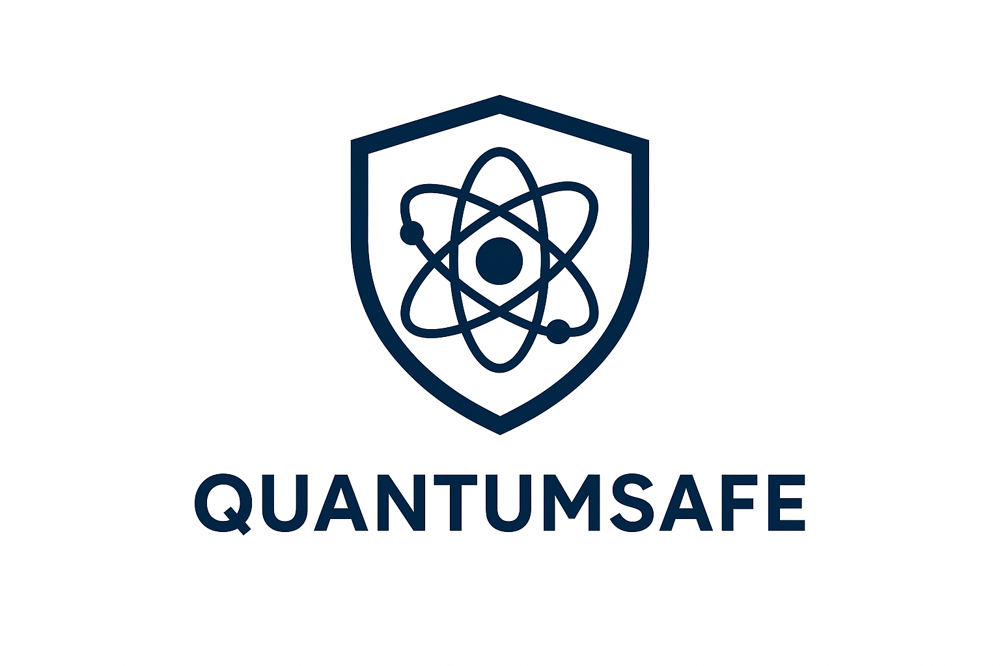

# 🛡️ QuantumSafe – Interactive Post-Quantum Cryptography Toolkit  

A hands-on educational toolkit exploring **Post-Quantum Cryptography (PQC)**.  
It demonstrates how classical cryptographic algorithms (RSA, ECC, AES, SHA-256) compare against **quantum threats**, and introduces **quantum-safe alternatives** like lattice-based and hash-based cryptography.  

---

## 📖 Features  
- 🔒 **Compare 6+ algorithms**: RSA, ECC, AES, SHA-256, Lattice, Hash-based  
- 📊 **Security visualizations**: Classical vs Quantum resistance (bit-level comparison)  
- 🔑 **Interactive key exchanges**: X25519, ECDH, and hash-based KDFs  
- ⚡ **Algorithm benchmarking**: Tested **2000+ operations** with reproducible results  
- 🧾 **14 code modules + 14 theory sections** combining practice & learning  

---


---

## 🛠️ Tech Stack  
- **Python 3.10+**  
- **NumPy** → numerical operations  
- **Matplotlib** → interactive charts & graphs  
- **cryptography** → modern crypto primitives (ECDH, X25519, hashing)  
- **Jupyter Notebook** → mix of code + explanation  

---

## 🚀 How to Run  

1. Clone the repository  
   ```bash
   git clone https://github.com/dronabopche/qusafe.git
   cd quantumsafe
